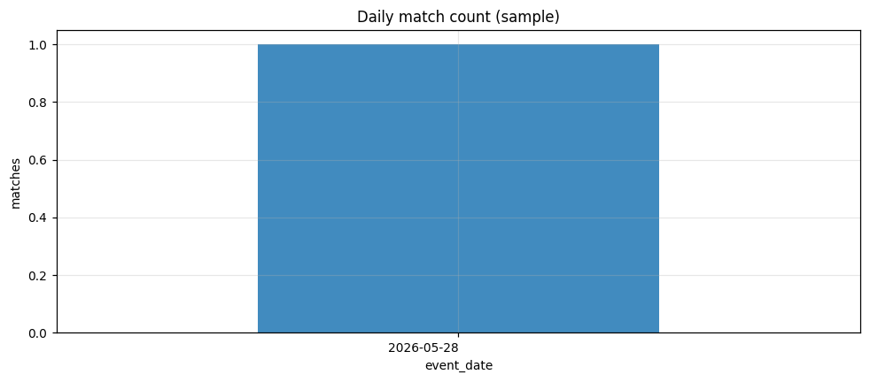
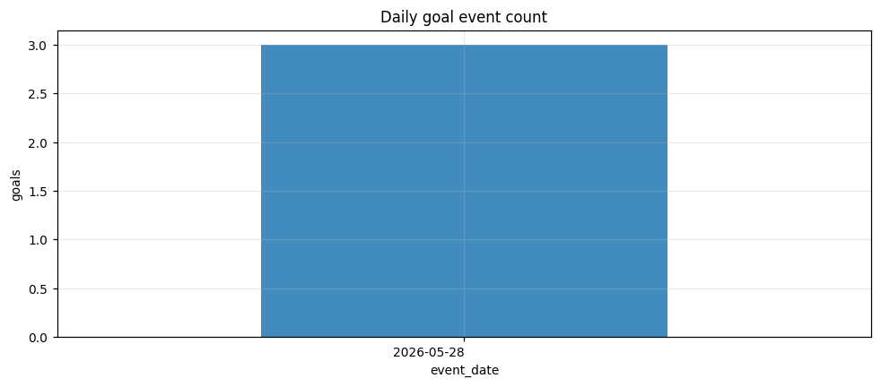
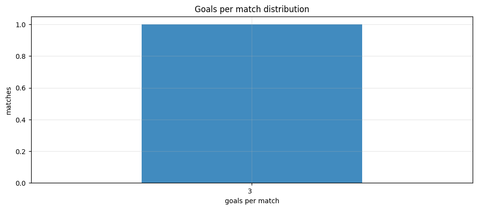
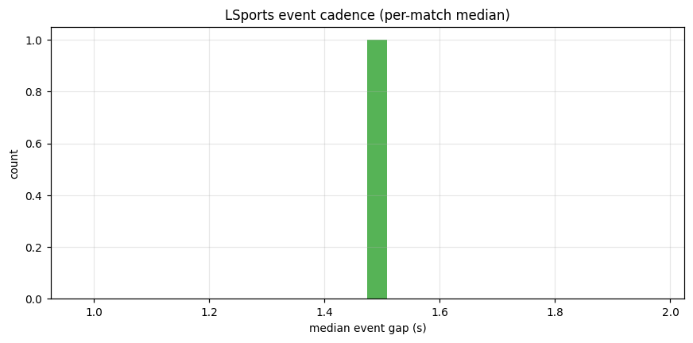
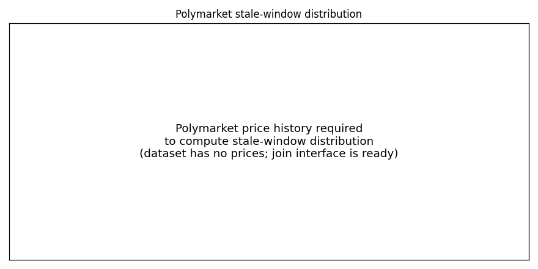

# 批量赛事统计报告 (2026-05-24 .. 05-28)

## 1. 样本范围

- 覆盖日期: 2026-05-24, 2026-05-25, 2026-05-26, 2026-05-27, 2026-05-28
- 每日采样上限: 40 场 (按 fixture_id 排序, 可复现)
- 实际解析比赛数: **1**, 进球事件数: **3**

## 2. 进球与比赛统计

- 平均每场进球: 3.00
- 有进球的比赛占比: 100.0%
- 平均每场实时事件数: 2755
- 平均每场黄牌: 39.0, 红牌: 0.00

### 每日比赛/进球数
| date | matches | goals |
|---|---|---|
| 2026-05-24 | 0 | 0 |
| 2026-05-25 | 0 | 0 |
| 2026-05-26 | 0 | 0 |
| 2026-05-27 | 0 | 0 |
| 2026-05-28 | 1 | 3 |

## 3. LSports 时间分辨率统计 (可直接验证的部分)

- 全样本事件间隔中位数 (每场中位的中位): **1.47 秒**
- 每场实时事件间隔 p90 的中位: 5.32 秒
- 归档延迟 p50 中位: 5328 秒 (批处理性质, 非实时)

## 4. Polymarket 延迟分析 (缺口与下一步)

- 本数据集**不含** Polymarket 价格, 因此 `goal_event_summary.csv` / `latency_summary.csv` 中的 polymarket / stale_window 列均为 NaN 占位。
- 已预留计算逻辑: 提供 fixture→market 映射 + 价格历史后, `latency_analysis.goal_price_reaction()` 与 `detect_stale_window()` 即可批量产出 LSports 领先比例 / stale window 分布 / 价格跳变幅度。
- 接入路径: Polymarket CLOB `/prices-history` 或 Gamma API (见 src/polymarket_loader.py)。

## 5. 进球前信号: 跨场建模 (诚实泛化评估)

- 特征帧来自 1 场, 太少, 不做跨场评估。

## 6. 图表

## 7. 结论 (基于当前可验证证据)

1. LSports 事件流在批量层面同样保持秒级更新, 时间分辨率足以支撑实时定价。
2. 当前本地缓存只有 1 场, 无法做跨场泛化; 进球前事件强度在单场层面可作为方法演示。
3. 是否真正领先 Polymarket、stale window 多长, 仍需价格历史验证; pipeline 已为该验证完全就绪。