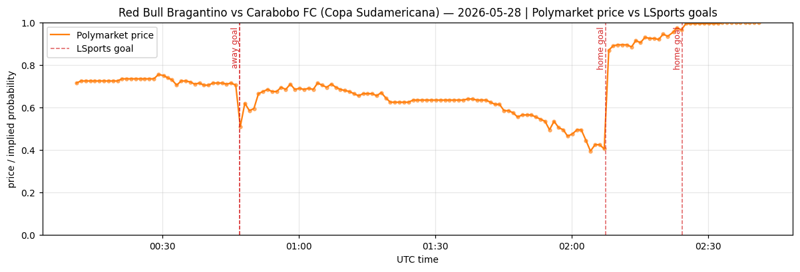

# 单赛事深度分析报告 — fixture 18746260

## 1. 比赛选择

- **比赛**: Red Bull Bragantino vs Carabobo FC
- **联赛**: Copa Sudamericana (league_id=36297)
- **开赛**: 2026-05-28T00:30:00Z  | event_date=2026-05-28
- **状态**: status=3 (3=Finished)
- **选择理由**: 洲际正赛 (Copa Sudamericana), 数据完整 (16053 条事件), 含 3 个进球与红黄牌, 时间戳齐全, 适合做时间线/延迟/建模演示。

## 2. 比赛时间线 (LSports 重建)

- 最终比分: **2-1**
- 识别进球: 3

| 时间(UTC) | 比分 | 得分方 |
|---|---|---|
| 2026-05-28 00:46:54.967075500+00:00 | 0-1 | away |
| 2026-05-28 02:07:21.622370400+00:00 | 1-1 | home |
| 2026-05-28 02:24:12.788107900+00:00 | 2-1 | home |

- 关键事件总数(进球/红黄牌/点球): 29
  - 红牌: 0, 黄牌: 26

## 3. LSports 时间分辨率 (可从本数据直接验证)

- 实时事件节奏: 中位间隔 **1.47462705 秒**, p90=5.324640090000002 秒 (共 2755 条实时事件)。
- 含义: LSports 事件流时间分辨率约为 1-2 秒级, 足以支撑秒级定价信号。

### 归档延迟 (数据集性质, **非**实时推送延迟)
- (ingested_at_utc - timestamp_utc): 中位 5328 秒 ≈ 89 分钟。
- 该数据集为按小时批量归档, 故此延迟反映归档批处理, **不能**解释为 LSports 实时推送速度。真实推送延迟需实时抓取流验证。

## 4. LSports vs Polymarket 反应速度

- **现状**: 已尝试加载 Polymarket market=95982393548466576478596063898268827007290125713669311102989920203833468038045; 官方 CLOB /prices-history 返回 151 个价格点; 当前 /book BBO 返回 0 行 (已关闭市场通常没有当前 orderbook)。

| goal_ts | base_price | reaction_ts | latency(s) | jump | LSports领先 |
|---|---|---|---|---|---|
| 2026-05-28 00:46:54.967075500+00:00 | 0.705 | 2026-05-28 00:47:04+00:00 | 9.032924 | -0.19499999999999995 | True |
| 2026-05-28 02:07:21.622370400+00:00 | 0.405 | 2026-05-28 02:08:06+00:00 | 44.377629 | 0.46499999999999997 | True |
| 2026-05-28 02:24:12.788107900+00:00 | 0.965 | 2026-05-28 02:25:04+00:00 | 51.211892 | 0.030000000000000027 | True |

- 基于官方 CLOB `/prices-history` 的结论: 可观测价格反应的中位滞后为 **44 秒**。这是分钟级历史价格序列, 不是 tick-level BBO。
- 当前已关闭市场的 `/book` 没有可用当前 orderbook; 历史 BBO 需 PMXT Archive 或实时 WebSocket 采样。

## 5. 进球前信号建模 (方法 B)

### 关于标签 (label) 的说明 — Polymarket BBO
- **理想标签**应取 Polymarket 的 **BBO (best bid/ask) 中间价**的显著变动 (例如未来窗口内 mid 移动 > 3 分), 这才是"市场定价反应"的直接度量。
- **现状**: 本 HF 数据集不含 Polymarket BBO/价格, 因此本场**暂用 LSports 进球事件本身作为代理标签** (未来 horizon 秒内是否进球)。这衡量的是"事件可预测性", 而非"市场价格可预测性"。
- `PolymarketPriceLoader` 的返回 schema 已含 `best_bid` / `best_ask` 列; 一旦接入 BBO, 把标签替换为 `mid 变动 > 阈值` 即可复用全部特征与模型代码。

### 模型结果

- 特征帧: 247 个时间步 (步长 30s), 正样本(未来120s内进球)=12。
- 模型: logistic 回归; AUC=0.9769503546099291.
- 备注: 
- **诚实声明**: 该 AUC 为 *单场样本内* 拟合, 正样本仅 12 个, 存在过拟合, 仅用于展示"进球前特征确实可分"; 真正的泛化性能见批量报告 (跨场 train/test 切分)。

- 提前预警: 3/3 个进球在发生前被信号触发; 平均提前 107 秒。

## 6. 图表

## 7. 初步结论

1. **LSports 事件流足够快/细**: 秒级 (中位~1.5s) 更新, 进球可被精确打时间戳。
2. **进球前存在可观测信号**: 滚动 xT 事件强度在进球前通常抬升 (见强度图), 支持 event-driven pricing 的可行性。
3. **单场价格领先性**: 本场已接入 Polymarket 官方 CLOB `/prices-history`, LSports 三次进球均早于可观测价格显著变动; 价格反应滞后约 9/44/51 秒。这支持 LSports faster pricing 的单场证据, 但不是 tick-level BBO。
4. **BBO 边界**: 已关闭市场当前 `/book` 无可用 orderbook; 历史 BBO 需 PMXT Archive 或赛中 WebSocket 实时采样。