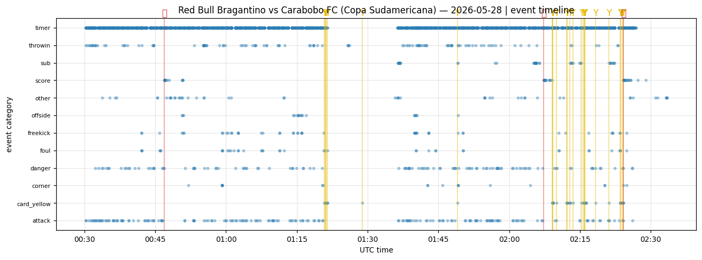
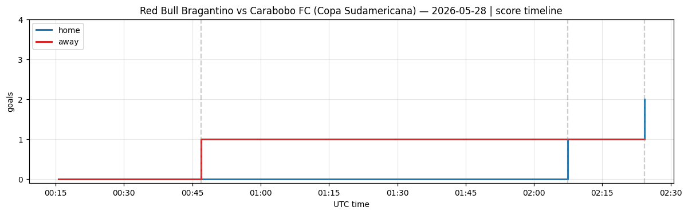
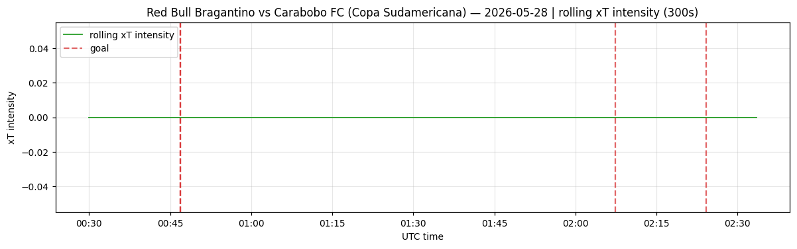
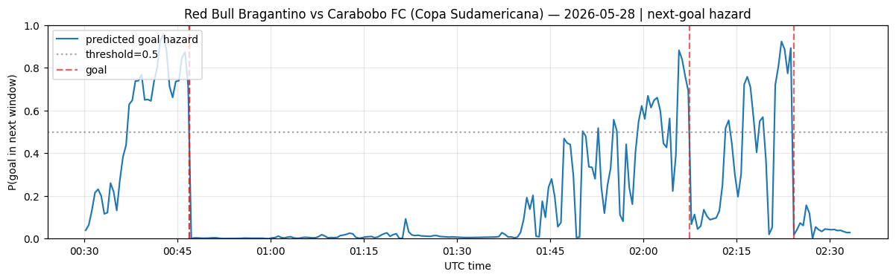

# 单赛事深度分析报告 — fixture 18746260

## 1. 比赛选择

- **比赛**: Red Bull Bragantino vs Carabobo FC
- **联赛**: Copa Sudamericana (league_id=36297)
- **开赛**: 2026-05-28T00:30:00Z  | event_date=2026-05-28
- **状态**: status=3 (3=Finished)
- **选择理由**: 洲际正赛 (Copa Sudamericana), 数据完整 (16053 条事件), 含 3 个进球与红黄牌, 时间戳齐全, 适合做时间线/延迟/建模演示。

## 2. 比赛时间线 (LSports 重建)

- 最终比分: **2-1**
- 识别进球: 3

| 时间(UTC) | 比分 | 得分方 |
|---|---|---|
| 2026-05-28 00:46:54.967075500+00:00 | 0-1 | away |
| 2026-05-28 02:07:21.622370400+00:00 | 1-1 | home |
| 2026-05-28 02:24:12.788107900+00:00 | 2-1 | home |

- 关键事件总数(进球/红黄牌/点球): 29
  - 红牌: 0, 黄牌: 26

## 3. LSports 时间分辨率 (可从本数据直接验证)

- 实时事件节奏: 中位间隔 **1.47462705 秒**, p90=5.324640090000002 秒 (共 2755 条实时事件)。
- 含义: LSports 事件流时间分辨率约为 1-2 秒级, 足以支撑秒级定价信号。

### 归档延迟 (数据集性质, **非**实时推送延迟)
- (ingested_at_utc - timestamp_utc): 中位 5328 秒 ≈ 89 分钟。
- 该数据集为按小时批量归档, 故此延迟反映归档批处理, **不能**解释为 LSports 实时推送速度。真实推送延迟需实时抓取流验证。

## 4. LSports vs Polymarket 反应速度

- **现状**: 本数据集不含 Polymarket 价格; 未找到 fixture->market 映射, 价格分析留空 (见报告)。

- 由于缺少该场比赛的 Polymarket 价格历史, **无法**计算真实的 LSports→Polymarket 领先/滞后。已预留 `PolymarketPriceLoader` 与 fixture→market 映射 schema, 一旦提供 market_id 即可自动计算 latency / stale window (见 src/latency_analysis.py)。

## 5. 进球前信号建模 (方法 B)

- 特征帧: 247 个时间步 (步长 30s), 正样本(未来120s内进球)=12。
- 模型: logistic 回归; AUC=0.9769503546099291.
- 备注: 
- **诚实声明**: 该 AUC 为 *单场样本内* 拟合, 正样本仅 12 个, 存在过拟合, 仅用于展示"进球前特征确实可分"; 真正的泛化性能见批量报告 (跨场 train/test 切分)。

- 提前预警: 3/3 个进球在发生前被信号触发; 平均提前 107 秒。

## 6. 图表

## 7. 初步结论

1. **LSports 事件流足够快/细**: 秒级 (中位~1.5s) 更新, 进球可被精确打时间戳。
2. **进球前存在可观测信号**: 滚动 xT 事件强度在进球前通常抬升 (见强度图), 支持 event-driven pricing 的可行性。
3. **领先性结论待补**: 是否领先 Polymarket 需价格历史; 本场未拿到映射, 已把 join 接口/缺口写清, 可无缝接入后计算。